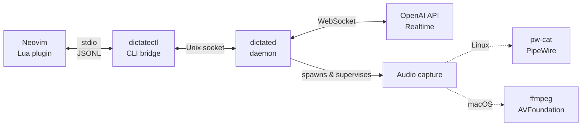

# dictate — real-time voice-to-text for Neovim

Speech-to-text dictation using OpenAI's Realtime API. Type with your voice in Neovim or get transcripts auto-copied to clipboard from your terminal.

**Features:**

- Real-time transcription with live ghost text preview
- Persistent daemon — survives editor restarts, handles multiple clients
- Cross-platform audio (Linux: PipeWire, macOS: ffmpeg)
- Simple toggle command (`:DictateToggle`)

## Quick Start

```bash
export OPENAI_API_KEY="sk-..."
bunx -p @tindotdev/dictate dictate
```

Speak into your microphone, press Ctrl+C when done. Transcript copied to clipboard.

## ⚠️ Privacy & Costs

Audio is transmitted to OpenAI's Realtime API in real-time. Usage is billable. Review [OpenAI pricing](https://openai.com/api/pricing/) and [privacy policy](https://openai.com/policies/privacy-policy/).

## Architecture



The daemon runs as a standalone service and handles WebSocket connections to OpenAI, audio capture (pw-cat on Linux, ffmpeg on macOS), and state management. Multiple Neovim instances can connect via `dictatectl`, a CLI bridge that translates stdio JSONL to Unix socket messages.

> Note: `dictate` is the user-facing CLI; it uses `dictatectl` under the hood for Neovim integration

## Requirements

**All platforms:**

- Bun runtime ([install](https://bun.sh))
- OpenAI API key with Realtime API access

**Linux:**

- PipeWire with `pw-cat` (package: `pipewire-utils` on Fedora, `pipewire` on Ubuntu/Debian)
- Clipboard: `wl-copy` (Wayland) or `xclip`/`xsel` (X11)
- Neovim 0.10+ (for plugin)

**macOS:**

- ffmpeg (`brew install ffmpeg`)
- Neovim 0.10+ (for plugin)

## Installation

### System Dependencies

**Linux (Fedora):**

```bash
sudo dnf install pipewire-utils wl-clipboard  # Wayland
# OR
sudo dnf install pipewire-utils xclip         # X11
```

**Linux (Ubuntu/Debian):**

```bash
sudo apt install pipewire wl-clipboard  # Wayland
# OR
sudo apt install pipewire xclip         # X11
```

**macOS:**

```bash
brew install ffmpeg
```

**Bun:**

Install Bun by following the official instructions: <https://bun.sh/docs/installation>.

### Desktop CLI

```bash
# Run without installing (recommended)
bunx -p @tindotdev/dictate dictate

# Or install globally
bun install -g @tindotdev/dictate
dictate
```

### Neovim Plugin

**Method A: Global Install (Recommended)**

Install daemon globally:

```bash
bun install -g @tindotdev/dictate
```

Add to lazy.nvim config:

```lua
{
  "tindotdev/dictate",
  keys = {
    { "<Leader>ad", "<Cmd>DictateToggle<CR>", desc = "AI Dictate" },
  },
}
```

Start daemon:

```bash
dictated &
# Or set up systemd service:
curl -fsSL https://raw.githubusercontent.com/tindotdev/dictate/main/scripts/install-service.sh | bash
```

**Method B: Local Development**

Clone and build:

```bash
git clone https://github.com/tindotdev/dictate.git
cd dictate/daemon
bun install
bun run build
```

Configure lazy.nvim:

```lua
{
  dir = "~/path/to/dictate",
  keys = {
    { "<Leader>ad", "<Cmd>DictateToggle<CR>", desc = "AI Dictate" },
  },
}
```

Set up systemd service:

```bash
cd ~/path/to/dictate
./scripts/install-service.sh
```

## Configuration

**Environment variables:**

```bash
export OPENAI_API_KEY="sk-..."
export OPENAI_STT_MODEL="gpt-4o-transcribe"  # Set by default
export OPENAI_STT_PROMPT="technical terms like Neovim, TypeScript"
export DEBUG=1  # Enable debug logging
```

**Plugin options:**

```lua
require("dictate").setup({
  daemon_cmd = nil,             -- Auto-detect
  keymap = nil,                 -- Optional (prefer lazy.nvim keys)
  ghost_hl = 'Comment',         -- Highlight for ghost text
  insert_trailing_space = true, -- Add space after text
  use_global_daemon = false,    -- false=local build, true=global package
})
```

## Usage

**Desktop CLI:**

```bash
dictate              # Transcribe to clipboard
dictate --stdout     # Print to stdout (and copy to clipboard)
dictate --no-clipboard # Print to stdout only
```

**Neovim:**

1. `:DictateToggle` — start dictation
2. Speak — ghost text appears at cursor
3. Pause — text inserted when speech completes
4. `:DictateToggle` — stop

**Commands:**

- `:DictateToggle` — toggle on/off
- `:DictateStart` — start
- `:DictateStop` — stop

**API:**

```lua
local dictate = require("dictate")
dictate.is_running()   -- true if process active
dictate.get_state()    -- 'stopped'|'connecting'|'connected'|'idle'|'listening'|'error'
dictate.is_active()    -- true if listening
dictate.is_audio_ok()  -- true if audio capture working
dictate.is_ws_ok()     -- true if WebSocket connected
```

## Development

```bash
cd daemon
export OPENAI_API_KEY="..."
bun dev        # Run in dev mode
bun test       # Run tests
bun run build  # Build for production
```

## Troubleshooting

### Audio not working

**Linux:**

```bash
pw-cat --version  # Check PipeWire installed
pw-cat --record --rate=24000 --channels=1 --format=s16 - | head -c 1000  # Test capture
```

**macOS:**

```bash
ffmpeg -version  # Check ffmpeg installed
ffmpeg -f avfoundation -list_devices true -i ""  # List devices
ffmpeg -f avfoundation -i ":0" -t 5 test.wav     # Test capture
# Grant microphone permission: System Settings > Privacy & Security > Microphone
```

### Clipboard warnings

**Linux Wayland:**

```bash
sudo dnf install wl-clipboard  # Fedora
sudo apt install wl-clipboard  # Ubuntu/Debian
echo "test" | wl-copy && wl-paste
```

**Linux X11:**

```bash
sudo dnf install xclip  # Fedora
sudo apt install xclip  # Ubuntu/Debian
echo "test" | xclip -selection clipboard && xclip -o -selection clipboard
```

**Fallback:** Use `dictate --no-clipboard`

### Daemon issues

```bash
ps aux | grep dictated  # Check if running

# Remove stale socket
rm $XDG_RUNTIME_DIR/dictate/dictate.sock  # Linux
rm ~/.local/state/dictate/dictate.sock    # macOS

pkill -f dictated  # Kill orphaned daemon
```

### Neovim: "dictatectl not found"

```bash
which dictatectl              # Check if installed
cd daemon && bun run build    # Build if using local clone
:checkhealth dictate          # Neovim diagnostics
```

### API errors

```bash
echo $OPENAI_API_KEY  # Verify key set
DEBUG=1 dictate --verbose
```

### Getting Help

- Run `:checkhealth dictate` in Neovim for diagnostics
- See [docs/runbook.md](docs/runbook.md) for detailed testing
- Enable debug mode with `DEBUG=1`
- [Report issues](https://github.com/tindotdev/dictate/issues) on GitHub

## Contributing

See [CONTRIBUTING.md](CONTRIBUTING.md) for development setup, testing guidelines, and pull request process.

**Security:** Report vulnerabilities privately via [SECURITY.md](SECURITY.md).

## License

MIT
