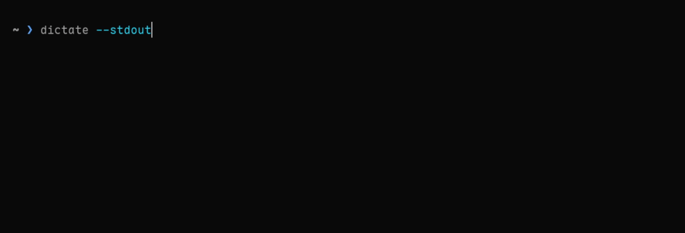

# dictate

Voice-to-text for Linux and macOS. Speak -> transcribe -> clipboard.



## Installation

Homebrew:

```bash
brew tap tindotdev/tap
brew install tindotdev/tap/dictate-cli
```

From source:

```bash
git clone https://github.com/tindotdev/dictate.git && cd dictate
just install
```

## Usage

```bash
dictate                        # record -> clipboard
dictate --stdout               # record -> stdout (+ clipboard)
dictate --no-clipboard         # record -> stdout only
dictate --stop-after 30s       # auto-stop after 30 seconds, then transcribe
dictate --language en          # language hint for accuracy
dictate --device <query>       # select device by name or index
dictate --save-last-audio      # save audio locally for retry
dictate retry                  # rerun Whisper + post-process on saved audio
dictate --transcription-provider fireworks
dictate -p --post-process-provider fireworks
dictate devices                # list audio input devices
```

Recording control:

- Press `Enter` to stop recording and continue to transcription
- For headless/scripted use, pass `--stop-after <duration>` (for example `30s`, `2m`, `500ms`)
- Press `Ctrl+C` to cancel the current session
- Cancelled `dictate` and `dictate retry` runs exit with status `130`
- After cancellation is observed, `dictate` does not print transcript output or write to the clipboard

### Retry the last recording

If a long dictation did not come out the way you wanted, save the audio once and
rerun transcription without speaking again:

```bash
dictate --save-last-audio -p
dictate retry
dictate retry --transcription-model large-v3
dictate retry --transcription-provider fireworks --post-process-provider fireworks
dictate retry --prompt "Keep the wording literal" -p
dictate retry --no-post-process
```

Notes:

- `dictate retry` reuses the last audio saved with `--save-last-audio`
- Retry inherits the saved recording's transcription and post-process settings by default
- Any flags passed to `dictate retry` override the saved settings for that run
- Retry replays the saved provider, endpoint, and raw model choices unless you override them
- Direct `dictate` recordings use shorter network timeouts and fewer retries so interactive/hotkey use stays bounded; `dictate retry` keeps longer, more persistent budgets
- Use `dictate retry --no-post-process` to compare raw Whisper output against a previously cleaned-up run
- The saved audio stays available until it is replaced by a later `--save-last-audio` recording

### Providers

Transcription and post-processing can be resolved independently:

```bash
dictate --transcription-provider groq
dictate --transcription-provider fireworks
dictate --transcription-provider openai-compatible --base-url https://host/v1/audio/transcriptions --transcription-model-id my-whisper-model
dictate -p --post-process-provider openai-compatible --post-process-base-url https://host/v1/chat/completions --post-process-model my-chat-model
```

Notes:

- `--transcription-model` stays semantic and provider-aware: `large-v3-turbo` or `large-v3`
- `--transcription-model-id` sets the raw provider ASR model id directly
- `openai-compatible` transcription requires both a raw model id and an explicit endpoint
- `openai-compatible` post-processing requires both a raw chat model and an explicit endpoint
- `--base-url` and `--post-process-base-url` still override the transcription and post-process endpoints for the current run

### Output formats

```bash
dictate --format verbose_json  # structured JSON
dictate --timestamps word      # word-level timestamps (requires verbose_json)
```

When `--post-process` is enabled with `--format json` or `--format verbose_json`, output includes:

- `post_processed` (boolean)
- `post_process_status` (`applied`, `failed_fallback`, `skipped_verbose_json`, `skipped_empty_text`, `not_configured`)

### Post-processing (LLM cleanup)

Optional post-processing cleans raw Whisper output (filler words, punctuation, capitalization).

```bash
dictate -p
dictate -p --post-process-model openai/gpt-oss-120b
dictate -p --post-process-provider fireworks
```

Notes:

- Groq default post-processing model: `openai/gpt-oss-20b`
- Fireworks default post-processing model: `accounts/fireworks/models/gpt-oss-120b`
- Fail-safe behavior: if post-processing fails, raw transcription text is still returned
- `--format verbose_json` skips post-processing to avoid mismatches between top-level `text` and timestamped `segments`/`words`
- `--post-process-base-url` is available for OpenAI-compatible chat endpoints

Quality is tracked with golden-case evaluations (`just eval-prompt`, `just eval-matrix`):

- 14 golden scenarios (filler removal, technical terms, punctuation, mixed and edge cases)
- Best tested matrix configuration: `openai/gpt-oss-20b` + `cleanup_v2.txt` = `14/14 (100%)`
- Current built-in runtime configuration: `openai/gpt-oss-20b` + `cleanup.txt` = `13/14 (93%)`

Detailed methodology and latest results:

- `crates/dictate-core/src/postprocess/prompts/README.md`
- `crates/dictate-core/src/postprocess/prompts/RESULTS-latest.md`

### Vocabulary

Custom terms improve transcription accuracy for technical jargon, names, and abbreviations.

```bash
dictate vocab add AWS OpenAI
dictate vocab remove AWS
dictate vocab list
dictate vocab edit
```

Vocabulary hints are injected into Whisper's prompt parameter and stored at `~/.config/dictate/`.

## Configuration

Required:

```bash
export GROQ_API_KEY="your-api-key"  # console.groq.com/keys
```

Optional:

```bash
export GROQ_BASE_URL="..."       # override transcription endpoint
export GROQ_CHAT_BASE_URL="..."  # override post-process chat endpoint
export FIREWORKS_API_KEY="..."   # fireworks.ai account key
export FIREWORKS_BASE_URL="..."  # override Fireworks transcription endpoint
export FIREWORKS_CHAT_BASE_URL="..."  # override Fireworks chat endpoint
export OPENAI_COMPATIBLE_API_KEY="..."
export OPENAI_COMPATIBLE_BASE_URL="..."
export OPENAI_COMPATIBLE_CHAT_BASE_URL="..."
```

Add to your shell profile for persistence. From source installs, `just add-secret` can help.

## Shell completions

Generate and install completions for your shell (fish, bash, zsh ):

```bash
dictate completions fish > ~/.config/fish/completions/dictate.fish
dictate completions bash > ~/.local/share/bash-completion/completions/dictate
dictate completions zsh > ~/.zfunc/_dictate  # then add ~/.zfunc to fpath
```

## Neovim

`dictate.nvim` controls `dictate-cli` directly from Neovim. It starts `dictate record`,
stops capture with `SIGUSR1`, and cancels in-flight transcription with `SIGINT`.
Transcript text is inserted into the buffer instead of relying on the clipboard.

Install with `lazy.nvim` using `opts`, `cmd`, and `keys`:

```lua
{
  "tindotdev/dictate",
  opts = {},
  cmd = { "DictateStart", "DictateStop", "DictateToggle", "DictateRetry" },
  keys = {
    {
      "<F9>",
      "<cmd>DictateToggle<cr>",
      desc = "Dictate Toggle",
    },
  },
}
```

Default plugin options:

```lua
require("dictate").setup({
  cmd = { "dictate" },
  args = {},
  clipboard = false,
  insert_trailing_space = true,
  disabled_filetypes = { "help", "lazy", "mason", "TelescopePrompt" },
  disabled_buftypes = { "nofile", "prompt", "quickfix", "terminal" },
})
```

Commands (available after the plugin is loaded):

- `:DictateStart`
- `:DictateStop`
- `:DictateToggle`
- `:DictateRetry`

Notes:

- Plugin-managed recordings automatically save the last audio so `:DictateRetry` works after `:DictateStart` and `:DictateStop`
- `:DictateRetry` runs `dictate retry` on that saved recording
- Record-only plugin args such as `--save-last-audio`, `--stop-after`, and `--device` are ignored for `:DictateRetry`
- Retry cannot be started while another dictate session is active
- The CLI handles retry-specific networking (longer timeouts, more retries) compared to interactive recordings

### Context enrichment

`context_enrichment` is opt-in and disabled by default. When enabled on supported
filetypes, the plugin extracts bounded markdown context near the insertion point
and passes it to the post-processing LLM as spelling and terminology hints.

```lua
require("dictate").setup({
  context_enrichment = {
    enabled = true,
    filetypes = { "markdown" },
    max_lines_before = 50,
    max_lines_after = 5,
    max_chars = 500,
  },
})
```

Notes:

- Context is sent to your configured post-processing provider only; enabling context enrichment implicitly enables post-processing for that recording
- Context is ephemeral: it is not saved with `--save-last-audio` recordings and is never replayed by `dictate retry`
- `:DictateRetry` collects fresh context from the current buffer rather than reusing context from the original recording
- Non-markdown buffers and filetypes not in `filetypes` never send context

Health checks:

```vim
:checkhealth dictate
```

### Local plugin development

For local plugin work, use the in-repo minimal Neovim profile instead of your full
editor config. It prepends this repo to `runtimepath`, maps `<F9>` to
`:DictateToggle`, and keeps the test loop isolated from unrelated plugins.

Fixture-backed smoke test (no microphone or API key required):

```bash
just nvim-dev-fake
```

Useful variants:

```bash
just nvim-dev-fake scenario=post_process
just nvim-dev-fake transcript="custom fixture text"
```

Real end-to-end test against the local debug binary:

```bash
cargo build -p dictate-cli
GROQ_API_KEY=... just nvim-dev-real
```

`just nvim-dev-real` now isolates `dictate-cli` from your normal user config by
pointing `XDG_CONFIG_HOME` and `XDG_DATA_HOME` at repo-local directories under
`tmp/nvim-dev-real/`. It seeds empty `vocabulary.json` and `dictionary.json`
from [tests/manual/fixtures/config/dictate/vocabulary.json](/mnt/68ce8b89-5b49-4f3f-857c-8c9edca5b28e/code/github/tindotdev/dictate/tests/manual/fixtures/config/dictate/vocabulary.json)
and [tests/manual/fixtures/config/dictate/dictionary.json](/mnt/68ce8b89-5b49-4f3f-857c-8c9edca5b28e/code/github/tindotdev/dictate/tests/manual/fixtures/config/dictate/dictionary.json),
so malformed files in `~/.config/dictate` do not affect plugin testing.

Inside the minimal profile:

- Run `:checkhealth dictate`
- Use `<F9>` or `:DictateToggle` to start and stop
- Run `:DictateDevInfo` to confirm which command/profile is active

Automated Neovim regression coverage remains available with:

```bash
just test-nvim
```

## Platform requirements

Linux:

- Audio: PipeWire or PulseAudio
- Clipboard: `wl-clipboard` (Wayland) or `xclip`/`xsel` (X11)
- Launcher notifications: `libnotify` (`notify-send`) and `glib2` (`gdbus`)

macOS:

- Grant microphone access to your terminal app
- Clipboard uses built-in `pbcopy` (no extra clipboard package required)

## Global shortcut

Install the canonical launcher files from this repo, then bind them to keyboard shortcuts:

```bash
just install-launchers
```

The desktop launcher is a toggle — press once to start recording, press again to stop. It runs
headlessly (no terminal window) and uses desktop notifications for feedback:

- **Recording** — persistent notification stays visible while recording
- **Transcribing** — replaces the recording notification after the launcher sends a dedicated stop signal
- **Cancelling** — pressing the shortcut again during transcription requests cancellation
- **Done** — shows result for 3 seconds, then auto-dismisses

Auto-stops after 5 minutes by default. Override with `DICTATE_TIMEOUT=120` (seconds).
If transcription still hangs after stop, the launcher escalates after
`DICTATE_TRANSCRIBE_TIMEOUT=45` seconds by default.

Linux compositor examples:

- Sway: `bindsym $mod+d exec dictate-launch -p`
- Hyprland: `bind = SUPER, D, exec, dictate-launch -p`
- COSMIC: `super + semicolon -> dictate-launch -p`

All flags after `dictate-launch` are passed through to `dictate` (e.g. `-p` for post-processing,
`--language en`, `--device "USB Mic"`).

Launcher control mapping on Linux/macOS:

- First press starts recording
- Second press during recording sends `SIGUSR1` to stop recording and continue to transcription
- Press again during transcription to send `SIGINT` cancellation
- Terminal `Ctrl+C` still means cancel, not stop

Kitty adapter:

- Install with `just install-launcher-kitty` or `just install-launchers`
- Bind in Kitty with:

```text
map kitty_mod+d launch --type=background dictate-kitty
map kitty_mod+shift+d launch --type=background dictate-kitty retry
```

The canonical launcher sources are:

- [contrib/launchers/dictate-launch](/mnt/68ce8b89-5b49-4f3f-857c-8c9edca5b28e/code/github/tindotdev/dictate/contrib/launchers/dictate-launch)
- [contrib/launchers/dictate-kitty](/mnt/68ce8b89-5b49-4f3f-857c-8c9edca5b28e/code/github/tindotdev/dictate/contrib/launchers/dictate-kitty)
- [contrib/launchers/dictate-launch-common.sh](/mnt/68ce8b89-5b49-4f3f-857c-8c9edca5b28e/code/github/tindotdev/dictate/contrib/launchers/dictate-launch-common.sh)

Repo-side launcher validation:

- `just test-launchers` runs start/stop/retry smoke tests against fake `dictate`, notification, and Kitty binaries
- `just lint-launchers` runs `shellcheck`

Compatibility wrappers remain at:

- [contrib/dictate-launch](/mnt/68ce8b89-5b49-4f3f-857c-8c9edca5b28e/code/github/tindotdev/dictate/contrib/dictate-launch)
- [contrib/dictate-kitty](/mnt/68ce8b89-5b49-4f3f-857c-8c9edca5b28e/code/github/tindotdev/dictate/contrib/dictate-kitty)

Debugging helpers:

- `DICTATE_STATE_DIR=/tmp/dictate-test` overrides where pid/state/output files are written
- `DICTATE_LAUNCH_LOG=/tmp/dictate-launch.log` appends launcher events and child exec lines
- `DICTATE_LAUNCH_TRACE=1` enables Bash xtrace; if `DICTATE_LAUNCH_LOG` is set, trace output goes there
- `DICTATE_BIN=/path/to/dictate` and `DICTATE_TRANSCRIPTION_MODEL=...` let you test alternate binaries/settings

On macOS outside Kitty, create a system shortcut (Shortcuts or Automator) that runs `dictate` in your terminal.

## Architecture

```text
microphone -> cpal -> resample (16kHz mono) -> chunking -> OpenAI-compatible ASR -> optional OpenAI-compatible LLM cleanup -> clipboard/stdout
```

- Audio capture: cpal with real-time resampling
- Ring buffer: lock-free SPSC for zero-allocation transfer
- Progressive chunking: overlapping chunks for long recordings
- Transcription: Groq, Fireworks, or another OpenAI-compatible ASR endpoint
- Post-processing: optional Groq, Fireworks, or OpenAI-compatible chat cleanup with fail-safe fallback
- Clipboard: platform-aware with fallback to stderr

## Troubleshooting

Audio:

- Linux: check `systemctl --user status pipewire`, then run `dictate devices`
- Linux: if needed, add your user to the `audio` group: `sudo usermod -aG audio $USER` (re-login required)
- macOS: verify microphone permission in System Settings -> Privacy & Security -> Microphone

Clipboard:

- Linux (Wayland): `echo "test" | wl-copy && wl-paste`
- Linux (X11): verify `xclip` or `xsel` is installed
- macOS: `echo "test" | pbcopy && pbpaste`

API errors:

- `401`: invalid API key
- `429`: rate limited (retries automatically)
- `413`: recording too long
- `dictate retry`: first create a reusable recording with `dictate --save-last-audio`

## Privacy

Audio is sent to the provider you configure for transcription and optional
post-processing. By default, audio is not stored locally. If you pass
`--save-last-audio`, dictate stores one reusable local recording until it is
replaced by a later saved recording. Review the privacy policy and terms for
whichever provider you use, such as [Groq](https://groq.com) or
[Fireworks](https://fireworks.ai/).

## Acknowledgments

Audio pipeline design inspired by [whis](https://github.com/frankdierolf/whis).

## License

MIT
